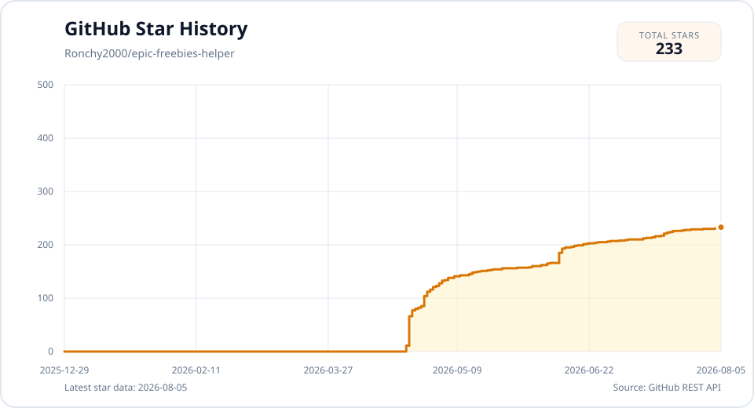

<div align="center">
  <h1>Epic 周免游戏领取助手</h1>
  <p>A fully free Epic weekly free-games claimer powered by GitHub Actions.</p>

  <p>
    <a href="https://github.com/Ronchy2000/epic-freebies-helper/actions/workflows/epic-gamer.yml"></a>
    <a href="https://www.python.org/"></a>
    <a href="LICENSE"></a>
    <a href="https://github.com/Ronchy2000/epic-freebies-helper/stargazers"></a>
    <a href="https://visitor-badge.laobi.icu/badge?page_id=Ronchy2000.epic-freebies-helper"></a>
  </p>
</div>

[🇨🇳 中文文档](README.md) | [🇺🇸 English](README.en.md)

**Epic 周免游戏领取助手** 面向普通用户，默认运行在 GitHub Actions 上。你不需要服务器，不需要本地常驻环境，也不用额外部署；只要有 GitHub 账号，按文档完成配置后就可以开始使用。

这个项目最核心的特点很直接：**完全免费**。

本项目基于社区开源方案持续完善，并接入了国产 `GLM` 多模态模型。项目核心目标是保障自动登录、验证码识别及结账流程的稳定性。相比配合 Gemini，配置 GLM 模型流程更简便，且免费额度足以满足日常自动运行需求。

**如果你选择 `GLM` 路线，请先确认对应智谱账号已经完成实名认证，否则通常无法正常使用 API。**
> 2026.4.28: 部分朋友反馈，不实名认证也能调用API，所以如出现无法使用的情况，请检查该项。
> 2026.7.30: 首次实名认证赠送三个月的glm-v4.7的资源包，因此可以正常使用三个月。

> [!WARNING]
> 若执行日志出现以下错误：
>
> `GLM quota/rate limit issue | http_status=429 | code=1113 | message=余额不足或无可用资源包，请充值。`
>
> 则说明资源包可能已经过期。您可以前往智谱官网充值少量余额后继续使用。（支持国产，从我做起！）

还没有智谱账号的话，可以通过这个邀请链接注册：[BigModel.cn 邀请注册链接](https://www.bigmodel.cn/invite?icode=A75tQCByIvrO4k6SLkU5BQZ3c5owLmCCcMQXWcJRS8E%3D)。

社区交流与反馈欢迎前往：[LINUX DO](https://linux.do/t/topic/2036835/4)。

如果你已经成功跑通，也欢迎来这里留言打卡：[🎉 成功反馈 / Success Stories](https://github.com/Ronchy2000/epic-freebies-helper/discussions/3)。

如果你遇到报错，也欢迎直接提 [Issue](https://github.com/Ronchy2000/epic-freebies-helper/issues)。当然，是否继续使用完全由你决定；但如果你愿意留下反馈，而不是直接删库放弃，这些真实问题和使用体验，都会帮助这个项目继续改进，也会成为我们一起把它做得更稳的动力。

---

## 功能概览

| 功能 | 说明 |
| --- | --- |
| 自动登录 | 自动完成 Epic 账号登录 |
| 自动发现周免 | 拉取并识别当周可领取游戏 |
| 自动领取 | 自动进入商品页并完成结账流程 |
| 领取结果通知 | 可选发送 Telegram 运行摘要 |
| 多账号支持 | 可选；不配置时保持原有单账号行为 |
| 验证码处理 | 支持登录验证码和 checkout 二次安全校验 |
| 定时执行 | 默认每周四晚通过 GitHub Actions 运行一次，可自行调整 |

---

## 为什么推荐 GLM

推荐优先使用 GLM 路线，主要优势如下：

- 配置更少：主要只要设置 `GLM_API_KEY` 和 `GLM_MODEL`。
- 成本更低：`glm-4.6v` 的免费额度通常足够覆盖周免领取场景。
- 更稳：`glm-4.6v-flash` 在高峰期偶尔会报“该模型当前访问量过大，请您稍后重试”，建议直接使用 `glm-4.6v`。
- 对国内用户更友好：不需要先解决 Google AI Studio 注册和可用性问题。
- 能力已验证：登录验证码、checkout 二次验证、拖拽/点选/多选题都能正常处理。

---

## 环境与前提要求

- Epic 账号邮箱与密码（用于登录）。
- 关闭 Epic 账号邮箱 / 短信 2FA；如使用验证器 App 2FA，请配置 `EPIC_TOTP_SECRET`。
- 注册 GLM 并准备 `GLM_API_KEY`（用于验证码识别）。

---

## 🚀 快速开始

基础配置与运行流程如下：

### 1. Fork 并启用 Actions

> [!TIP]
> 如果你已经 Fork 过这个仓库，建议先在 GitHub 网页上进入你自己的仓库，点击 `Sync fork` -> `Update branch`，先和最新项目保持一致，再继续后面的配置和运行。

Fork 之后先打开自己仓库的 `Actions` 页面，进入 `Epic Awesome Gamer (Scheduled)` 并点一次 `Enable workflow`，否则 GitHub 不会让这个 Fork 的定时 `schedule` 自动生效。

- Fork 到自己的 GitHub 账号。
- 打开 `Actions`，启用工作流 `Epic Awesome Gamer (Scheduled)`。

### 2. 配置 Secrets 和 Variables

进入 `Settings` -> `Secrets and variables` -> `Actions`。

账号、密码和 API Key 必须放在 `Secrets`。`LLM_PROVIDER` 以及所有 `*_MODEL` 模型名属于非敏感配置，建议放在 `Variables`；工作流会优先读取 Variables，并继续兼容已有的同名 Secrets。程序启动时会打印实际模型路由，包括 `SPATIAL_PATH_REASONER_MODEL`。如果模型名仍保存在 Secrets 中，GitHub 会把日志里的同值自动显示为 `***`；迁移到 Variables 并删除同名 Secret 后即可正常显示。

必须配置（单账号，默认路径）：

| 配置名 | 示例值 |
| --- | --- |
| `EPIC_EMAIL` | your_epic_email@example.com |
| `EPIC_PASSWORD` | your_epic_password |

如果 Epic 账号启用了验证器 App 2FA，请额外配置：

| 配置名 | 示例值 |
| --- | --- |
| `EPIC_TOTP_SECRET` | 验证器二维码对应的 Base32 密钥 |

工作流会在 MFA 页面自动生成 6 位 TOTP。邮箱验证码、短信验证码和 Passkey 暂不支持；不要填写当前显示的 6 位动态验证码。

如果需要接收 Telegram 领取结果通知，请额外配置以下 Secrets：

| 配置名 | 示例值 |
| --- | --- |
| `TELEGRAM_BOT_TOKEN` | Telegram Bot Token |
| `TELEGRAM_CHAT_ID` | Telegram 聊天 ID |

两个配置需要同时存在才会发送通知。通知包含运行状态、本周游戏、新领取、此前已拥有、未确认成功项目及失败原因。Telegram 发送失败不会影响领取任务；未配置时保持现有行为。

如果共享云 IP 导致 hCaptcha 风控明显加重，可选配置 `BROWSER_PROXY` Secret。支持 `http://用户名:密码@主机:端口`、`https://...`、`socks4://...` 和 `socks5://...`；未配置时浏览器网络路径保持不变。代理质量、可信度和费用由使用者自行负责。

如果你使用 `GLM`，建议先按下面这组填写：

**如果你把 `LLM_PROVIDER` 设为 `glm`，就必须填写 `GLM_API_KEY`；无需新建并填写 `GEMINI_API_KEY`。**

| 配置名 | 示例值 |
| --- | --- |
| `LLM_PROVIDER` | glm |
| `GLM_API_KEY` | 你的智谱 API Key |
| `GLM_BASE_URL` | https://open.bigmodel.cn/api/paas/v4 |
| `GLM_MODEL` | glm-4.6v |

配置页面示例：


如果你使用 `Gemini 官方接口`，请按下面这组填写：

**如果你把 `LLM_PROVIDER` 设为 `gemini`，就必须填写 `GEMINI_API_KEY`；无需新建并填写 `GLM_API_KEY`。**

| 配置名 | 示例值 |
| --- | --- |
| `LLM_PROVIDER` | gemini |
| `GEMINI_API_KEY` | 你的 Gemini API Key |
| `GEMINI_BASE_URL` | 留空 |
| `GEMINI_MODEL` | gemini-2.5-pro |

如果你使用 `AiHubMix` 这类 Gemini 兼容中转接口，请按下面这组填写：

| 配置名 | 示例值 |
| --- | --- |
| `LLM_PROVIDER` | gemini |
| `GEMINI_API_KEY` | 你的 AiHubMix Key |
| `GEMINI_BASE_URL` | https://aihubmix.com |
| `GEMINI_MODEL` | gemini-2.5-pro |

说明：

- 当前代码同时支持 `Gemini 官方接口` 和 `AiHubMix` 这类 Gemini 兼容接口。
- 变量名是 `GEMINI_BASE_URL`，不是 `GEMINI_BASE_MODEL`。
- `LLM_PROVIDER=glm` 时，请填写 `GLM_API_KEY`，无需新建并填写 `GEMINI_API_KEY`。
- `LLM_PROVIDER=gemini` 时，请填写 `GEMINI_API_KEY`，无需新建并填写 `GLM_API_KEY`。
- 使用 `Gemini 官方接口` 时，`GEMINI_BASE_URL` 应留空，让 SDK 直接走 Google 官方默认地址。
- 使用 `AiHubMix` 或其他 Gemini 兼容中转接口时，再填写对应的 `GEMINI_BASE_URL`。
- 对 `GLM` 路线，推荐把 `GLM_MODEL` 设为 `glm-4.6v`；`glm-4.6v-flash` 在高峰期可能报“该模型当前访问量过大，请您稍后重试”。
- 对 `Gemini` / `AiHubMix` 路线，建议先用 `GEMINI_MODEL=gemini-2.5-pro` 作为起步配置。
- `CHALLENGE_CLASSIFIER_MODEL`、`IMAGE_CLASSIFIER_MODEL`、`SPATIAL_POINT_REASONER_MODEL`、`SPATIAL_PATH_REASONER_MODEL` 如果留空，会自动跟随当前 provider 的默认模型，也就是 `GLM_MODEL` 或 `GEMINI_MODEL`。
- 如果你暂时不想细分模型，最简单的做法就是让上面 4 个覆盖项全部留空。
- 走 `GLM` 路线时不需要额外再填 `GEMINI_API_KEY`。

如果你确实要单独覆盖这 4 个模型，可以直接照下面填写：

| 配置名 | GLM 示例值 | Gemini / AiHubMix 示例值 |
| --- | --- | --- |
| `CHALLENGE_CLASSIFIER_MODEL` | 留空或 `glm-4.6v` | 留空或 `gemini-2.5-pro` |
| `IMAGE_CLASSIFIER_MODEL` | 留空或 `glm-4.6v` | 留空或 `gemini-2.5-pro` |
| `SPATIAL_POINT_REASONER_MODEL` | 留空或 `glm-4.6v` | 留空或 `gemini-2.5-pro` |
| `SPATIAL_PATH_REASONER_MODEL` | 留空或 `glm-4.6v` | 留空或 `gemini-2.5-pro` |

### 多账号配置（可选）

这一项完全可选。只配置 `EPIC_EMAIL` / `EPIC_PASSWORD` 时，行为与现有单账号路径一致，不需要改任何现有配置。

如果你有多个 Epic 账号，可以用一个 Secret 同时管理，无需多次 Fork。

进入 `Settings` -> `Secrets and variables` -> `Actions`，新建一个 Secret：

| 配置名 | 示例值 |
| --- | --- |
| `EPIC_ACCOUNTS` | 每行一个账号，格式为 `邮箱:密码` |

示例：

```text
user1@example.com:password1
user2@example.com:password2
user3@example.com:password3
```

说明：

- 不设置 `EPIC_ACCOUNTS`（或为空）时，直接走原来的单账号路径，不经过账号切换或异常聚合，现有配置与行为不变。
- 设置了 `EPIC_ACCOUNTS` 且**全部行都合法**时，进入多账号顺序执行。
- 设置了 `EPIC_ACCOUNTS` 但**没有任何合法行**时，仅当 `EPIC_EMAIL` / `EPIC_PASSWORD` 均已配置才回退到原单账号路径；否则立即报告配置错误，不会以空凭据启动浏览器。
- 设置了 `EPIC_ACCOUNTS` 且**部分行合法、部分行非法**时，任务会直接以配置错误失败（指出非法行号），不会静默跳过某些账号后报成功。
- 邮箱格式会做轻量校验，并拒绝路径分隔符与控制字符；密码中如果包含冒号 `:`，只会按第一个冒号分割。
- 每个账号独立运行：一个账号失败不影响其他账号；每个账号仍复用当前的登录、hCaptcha、TOTP、Telegram 与浏览器运行时路径。
- 每个账号自动使用独立的浏览器配置目录（按邮箱隔离），互不干扰。
- 多账号 Telegram 通知会附带打码后的账号标签；单账号通知格式保持不变。
- 当前 `EPIC_TOTP_SECRET` 仍是全局配置，适合同一验证器密钥，或只给其中一个账号开 TOTP 的场景；按账号拆分 TOTP 还不支持。
- 多账号是在同一个任务里顺序执行的，账号越多耗时越长。工作流超时时间可以通过仓库变量 `JOB_TIMEOUT_MINUTES` 调整（默认 60 分钟），账号较多时建议调大。

### 3. 手动运行一次

- 进入 `Actions` 页面。
- 选择 `Epic Awesome Gamer (Scheduled)`。
- 点击 `Run workflow`。

> [!IMPORTANT]
> **注意**：受 Epic 风控机制影响，脚本在验证码及结账环节可能触发多次重试，单次运行耗时可能长达 15 至 20 分钟。在运行结束前，建议勿手动中断工作流。

### 4. 看日志确认是否跑通

成功时日志通常会出现类似内容：

```text
Login success
Right account validation success
Authentication completed
Starting free games collection process
All week-free games are already in the library
```

示例日志（中间有报错但最终成功）：


如果你在日志里看到多次重试后手动取消，像下面这样；请你下一次运行时多给它一些耐心，有些脚本通常运行15min至20min才成功：


---

## 运行日志与 Artifact

每次 GitHub Actions 运行结束后，工作流会尝试上传下面这些 artifact。GitHub 只会显示实际有文件的 artifact，所以不同用户可能只看到其中一部分，这是正常现象。

| Artifact | 内容 | 通常什么时候出现 |
| --- | --- |
| `epic-logs-<run_id>` | 运行日志 | 基本每次运行都会有 |
| `epic-runtime-<run_id>` | `promotions.json`、`purchase_debug` 截图和文本 | 已进入周免领取、商品页或 checkout 阶段时常见 |
| `epic-screenshots-<run_id>` | 登录失败、风控页、授权页等额外截图 | 登录、风控或授权阶段保存过截图时才会有 |

下载位置：

1. 进入本次 Actions 运行页面
2. 拉到页面底部
3. 找到 `Artifacts`
4. 下载 zip 文件

说明：

| 文件包 | 先看什么 |
| --- | --- |
| `epic-logs-<run_id>.zip` | 解压后直接看里面的日志文件 |
| `epic-runtime-<run_id>.zip` | 如果存在，解压后优先看 `purchase_debug/` 里的截图和调试文本 |
| `epic-screenshots-<run_id>.zip` | 如果存在，优先看登录页、风控页或授权页截图 |

这些内容是 GitHub Actions 每次运行后打包上传的产物，不是仓库根目录里预置好的固定目录。

如果你要提 issue，请不要只粘贴一小段日志。最有用的做法是：

1. 打开出问题的 GitHub Actions 运行页面。
2. 拉到页面底部，找到 `Artifacts`。
3. 下载页面中实际出现的 artifact：
   - `epic-logs-<run_id>.zip`：优先下载，通常每次都有
   - `epic-runtime-<run_id>.zip`：如果页面中有这个包就下载
   - `epic-screenshots-<run_id>.zip`：如果页面中有这个包就下载
4. 新建 issue。
5. 把这些 zip 直接拖进 issue 编辑框，或者点击附件按钮上传。

这些 zip 里通常已经包含定位问题所需的完整日志、截图和 `purchase_debug` 文本。GitHub issue 支持直接上传 `.zip` 文件。

补充说明：

- 如果你的 fork 是公开仓库，通常附上本次 Actions 运行链接即可，维护者一般可以直接查看对应页面。
- 如果你的 fork 是私有仓库，请务必上传本次运行实际出现的 artifact zip；维护者无法直接访问私有仓库的 Actions 页面和运行产物。

---

## 本地单次调试

如果你想在本地复现和 GitHub Actions 相同的入口，可以直接用仓库内置单次执行方式：

1. 复制 [`.env.example`](.env.example) 为 `.env`
2. 填好你自己的账号和模型配置
3. 执行 `uv sync --group dev`
4. 执行 `ENABLE_APSCHEDULER=false uv run app/deploy.py`

`.env`、`.venv`、`app/volumes/` 都已经被 `.gitignore` 忽略，不会被提交到 GitHub。

> [!TIP]
> 如果你的密码或 API Key 含有 `$`、`\`、`#`、`` ` `` 等字符，请用单引号包起来，例如 `EPIC_PASSWORD='abc$def'`，避免 `python-dotenv` 把 `$xxx` 当成变量插值丢失字符。GitHub Actions Secrets 不受此影响。

---

## 常见问题

### 1. 登录偶发失败

**原因**：GitHub Actions 环境采用公共 IP，易触发 Epic 严格风控，导致验证码成功率波动，属预期内现象。

### 2. 日志里出现 `privacy-policy correction` 或卡在隐私政策页面

这通常不是模型接口问题，而是 Epic 账号状态问题。某些账号在登录成功后，会被额外重定向到类似 `/id/login/correction/privacy-policy` 的页面，要求先确认一次隐私政策。

处理方式很简单：先在你自己的正常浏览器里手动登录 Epic，完成这个确认页，然后再重新运行 Actions。

### 3. 日志里出现 `two_factor_authentication.required` 或页面跳到 `/id/login/mfa`

这说明 Epic 账号进入了二步验证流程。如果使用验证器 App 2FA，可以在 GitHub Secrets 中配置 `EPIC_TOTP_SECRET`，工作流会自动生成并提交 6 位 TOTP。邮箱验证码、短信验证码和 Passkey 暂不支持。

如果你看到下面这些信号，通常都可以按“账号需要 2FA 验证”处理：

- `errors.com.epicgames.common.two_factor_authentication.required`
- `Two-Factor authentication required to process request`
- 页面跳转到 `/id/login/mfa`

处理方式：

1. 在你自己的正常浏览器里登录 Epic 账号
2. 进入账号安全设置页面
3. 如使用验证器 App 2FA，把二维码对应的 Base32 密钥填到 GitHub Secrets 的 `EPIC_TOTP_SECRET`
4. 不使用验证器自动填码时，把当前启用的验证方式点 `Remove`
5. 重新运行 Actions

参考界面如下：


### 4. 页面弹出 `One more step`

这不是异常，是 Epic 结账阶段追加的人机校验。

**说明**：此为 Epic 结账阶段追加的安全校验机制。项目已适配该环节的自动化处理逻辑，出现这类弹窗不代表脚本已经失效。


### 5. 页面提示 `Device not supported`

这个提示通常出现在商品只支持 Windows，而 GitHub Actions 运行环境是 Linux 的时候。

它本身不一定代表领取失败。当前脚本会尝试自动点击弹窗里的 `Continue` 继续进入后续流程。

### 6. 为什么工作流显示成功，但游戏没入库

过去常见根因有：

| 原因 | 说明 |
| --- | --- |
| 商品页状态识别不准 | 页面文案和实际状态不一致 |
| `Place Order` 已点击但未完成 | 结账页仍停留在二次验证 |
| 页面出现额外弹窗 | 例如设备不支持、额外确认 |
| 旧逻辑误判 | 曾经把普通文案误判成“已拥有” |

---

## Docker 部署

如果你不想用 GitHub Actions，也可以在自己的服务器、NAS 或本地 Docker 环境里跑。

### 1. 克隆仓库

```bash
git clone https://github.com/Ronchy2000/epic-freebies-helper.git
cd epic-freebies-helper
```

### 2. 修改配置

主要入口是 [`docker/docker-compose.yaml`](docker/docker-compose.yaml)。

GLM 示例：

```yaml
environment:
  - LLM_PROVIDER=glm
  - GLM_API_KEY=your_glm_key
  - GLM_BASE_URL=https://open.bigmodel.cn/api/paas/v4
  - GLM_MODEL=glm-4.6v
```

Gemini 官方接口示例：

```yaml
environment:
  - LLM_PROVIDER=gemini
  - GEMINI_API_KEY=your_gemini_key
  - GEMINI_BASE_URL=
  - GEMINI_MODEL=gemini-2.5-pro
```

AiHubMix 示例：

```yaml
environment:
  - LLM_PROVIDER=gemini
  - GEMINI_API_KEY=your_key
  - GEMINI_BASE_URL=https://aihubmix.com
  - GEMINI_MODEL=gemini-2.5-pro
```

### 3. 启动

```bash
docker compose up -d --build
```

---

## 进阶文档

如果你想看项目结构、适配细节、开发者排障记录和这次踩过的坑，请继续阅读：

- [开发者进阶文档](docs/advanced.md)
- [Advanced Guide (English)](docs/advanced.en.md)
- [维护日志](docs/maintenance-log.md)

---

## 项目来源与参考

本项目基于 `QIN2DIM/epic-awesome-gamer` 实现，并参考了 `10000ge10000/epic-kiosk`：

| 项目 | 说明 |
| --- | --- |
| [QIN2DIM/epic-awesome-gamer](https://github.com/QIN2DIM/epic-awesome-gamer) | 原始项目与核心自动化思路来源 |
| [10000ge10000/epic-kiosk](https://github.com/10000ge10000/epic-kiosk) | GitHub Actions 化和文档组织方式的重要参考 |
| [LINUX DO](https://linux.do/t/topic/2036835/4) | 社区交流、反馈与项目推广支持 |

感谢原作者、维护者和社区的长期积累。

---

## 免责声明

- 本项目仅用于学习和研究自动化流程。
- 自动化操作可能违反相关平台的服务条款，请自行评估风险。
- 使用本项目产生的后果由使用者自行承担。

---

## Star 趋势

<a href="https://github.com/Ronchy2000/epic-freebies-helper/stargazers">
  <picture>
    <source
      media="(prefers-color-scheme: dark)"
      srcset="docs/images/star-history-dark.svg"
    />
    <source
      media="(prefers-color-scheme: light)"
      srcset="docs/images/star-history-light.svg"
    />
    
  </picture>
</a>

---

## 社区致谢

本项目的持续完善，离不开每一位在遇到报错时没有选择放弃，而是耐心回传完整错误现场的使用者。

许多边界情况的修复，并非源自开发者的独自排查，而是建立在大家主动提供的详实日志、截图与复现步骤之上。正是这些真实的报错数据，让各种隐蔽的问题得以被精准定位并解决。

在此，向所有提供过反馈的用户致以由衷的感谢。是你们投入的时间与提供的测试数据，逐步扫除了开发过程中的盲区，让这个项目日益稳定，切实帮助到了更多人。

<div align="center">
  <sub>感谢每一位提过 issue、上传过 artifact、留下过真实失败案例的朋友。</sub>
</div>

<p align="center">
  <a href="https://github.com/AaronL725"></a>
  <a href="https://github.com/cita-777"></a>
  <a href="https://github.com/1208nn"></a>
  <a href="https://github.com/LGDhuanghe"></a>
  <a href="https://github.com/AdjieC"></a>
  <a href="https://github.com/Leafrostar"></a>
  <a href="https://github.com/AcosX"></a>
  <a href="https://github.com/Elykia093"></a>
  <a href="https://github.com/ZoveyOhhh"></a>
</p>

<!-- <p align="center">
  <sub>
    <a href="https://github.com/AaronL725"><b>AaronL725</b></a> ·
    <a href="https://github.com/cita-777"><b>cita-777</b></a> ·
    <a href="https://github.com/1208nn"><b>1208nn</b></a> ·
    <a href="https://github.com/LGDhuanghe"><b>LGDhuanghe</b></a> ·
    <a href="https://github.com/AdjieC"><b>AdjieC</b></a> ·
    <a href="https://github.com/Leafrostar"><b>Leafrostar</b></a> ·
    <a href="https://github.com/AcosX"><b>AcosX</b></a> ·
    <a href="https://github.com/Elykia093"><b>Elykia093</b></a> ·
    <a href="https://github.com/ZoveyOhhh"><b>ZoveyOhhh</b></a>
  </sub>
</p> -->

<!--
Avatar wall template:

<p align="center">
  <a href="https://github.com/<username-1>">.png?size=96" width="64" height="64" alt="@<username-1>" /></a>
  <a href="https://github.com/<username-2>">.png?size=96" width="64" height="64" alt="@<username-2>" /></a>
  <a href="https://github.com/<username-3>">.png?size=96" width="64" height="64" alt="@<username-3>" /></a>
</p>

<p align="center">
  <sub>
    <a href="https://github.com/<username-1>"><b><username-1></b></a> ·
    <a href="https://github.com/<username-2>"><b><username-2></b></a> ·
    <a href="https://github.com/<username-3>"><b><username-3></b></a>
  </sub>
</p>
-->
